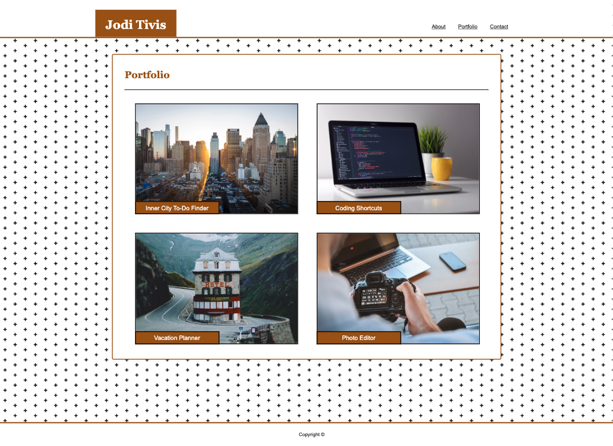
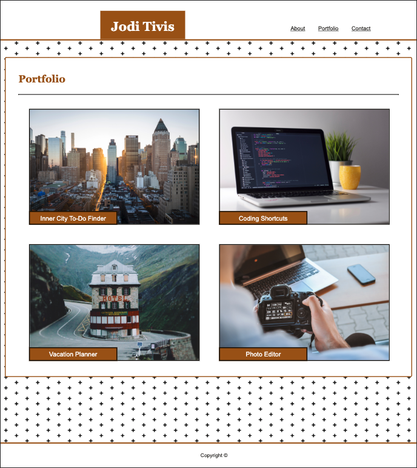
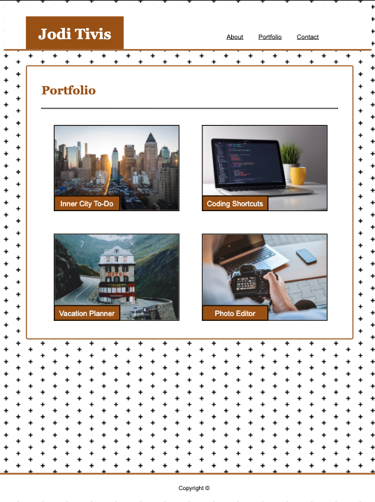
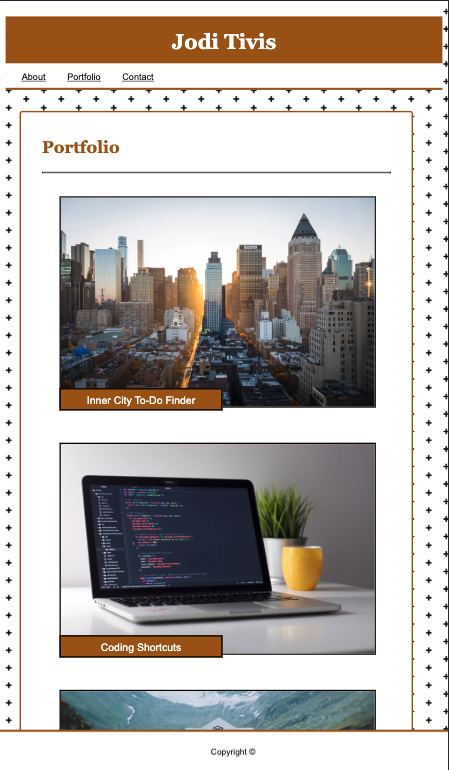

# Responsive-Portfolio

This assignment required the use of media queries to make our first assignment (Basic-Portfolio) responsive to any viewport

 __Link to Webpage: https://joditivis.github.io/Responsive-Portfolio/__

__Tools/Languages Used:__
```
- HTML5
- CSS
  -> media queries used within CSS for a responsive and functioning sight for any viewport 
```

---
__Folders + Files Used to Format Each Page:__
```
Responsive-Portfolio Folder
  1. index.html
  2. portfolio.html
  3. contact.html
    -- assets Folder
      1. css folder -> style.css
      2. images folder -> all image files kept here
```
Placeholder images for portfolio found on https://unsplash.com/

---
# Viewport Responsive:
## Regular desktop screen:


## Viewport 980px (Tablet):


## Viewport 768px (iPad):


## Viewport 640px (iPhone):


---

## Contributors:

- Jodi Tivis